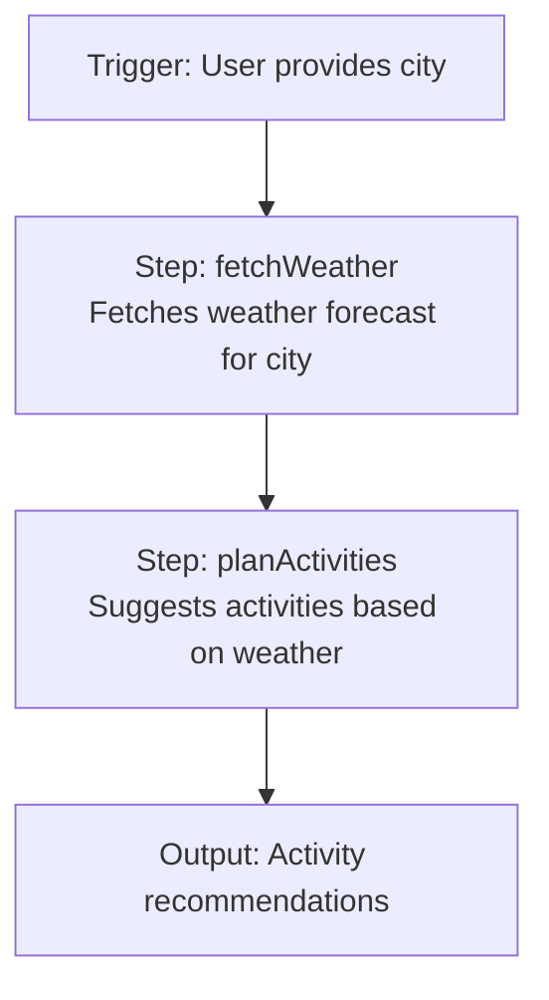
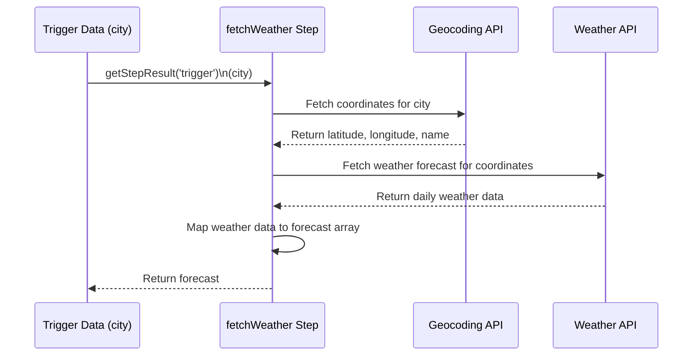

# Weather Workflow Diagram

fetchWeather Step

**Step details:**
- **Trigger:** The workflow starts when a user provides a city name.
- **fetchWeather:** Uses the city to fetch latitude/longitude, then retrieves a weather forecast for that location.
- **planActivities:** Takes the weather forecast and generates activity recommendations using the agent.
- **Output:** Returns the formatted activity recommendations. 