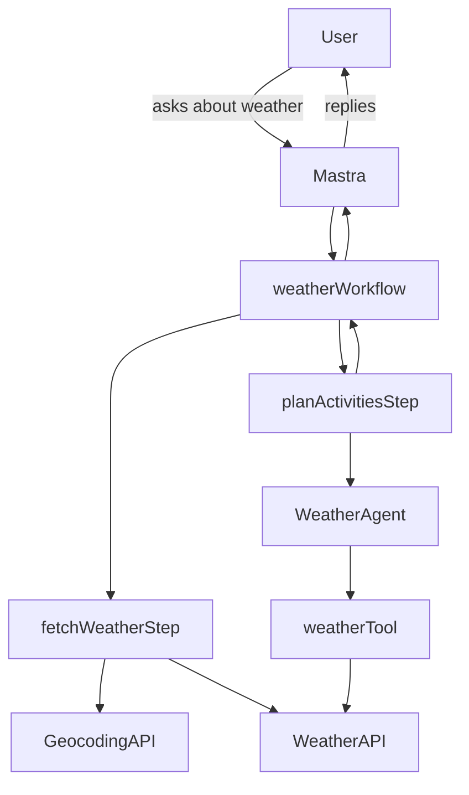

```mermaid
flowchart TD
    User --> |asks about weather| Mastra
    Mastra --> weatherWorkflow
    weatherWorkflow --> fetchWeatherStep
    fetchWeatherStep --> GeocodingAPI
    fetchWeatherStep --> WeatherAPI
    weatherWorkflow --> planActivitiesStep
    planActivitiesStep --> WeatherAgent
    WeatherAgent --> weatherTool
    weatherTool --> WeatherAPI
    planActivitiesStep --> weatherWorkflow
    weatherWorkflow --> Mastra
    Mastra --> |replies| User
```